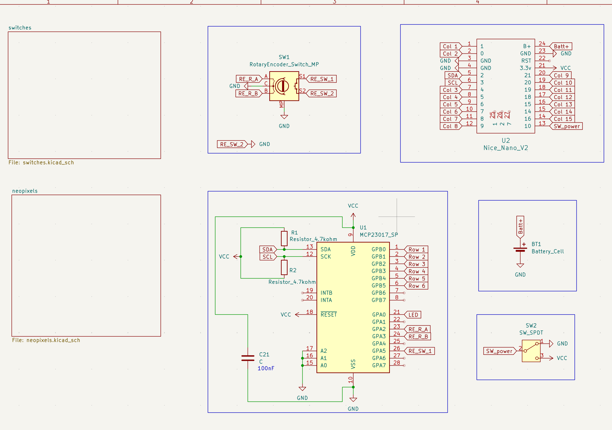
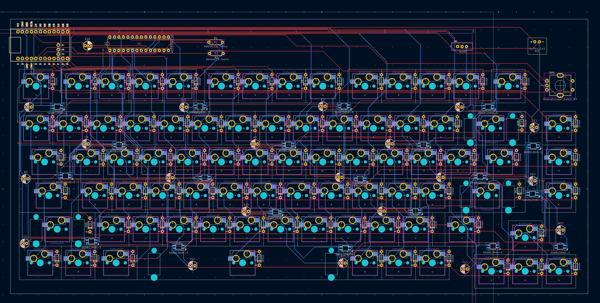
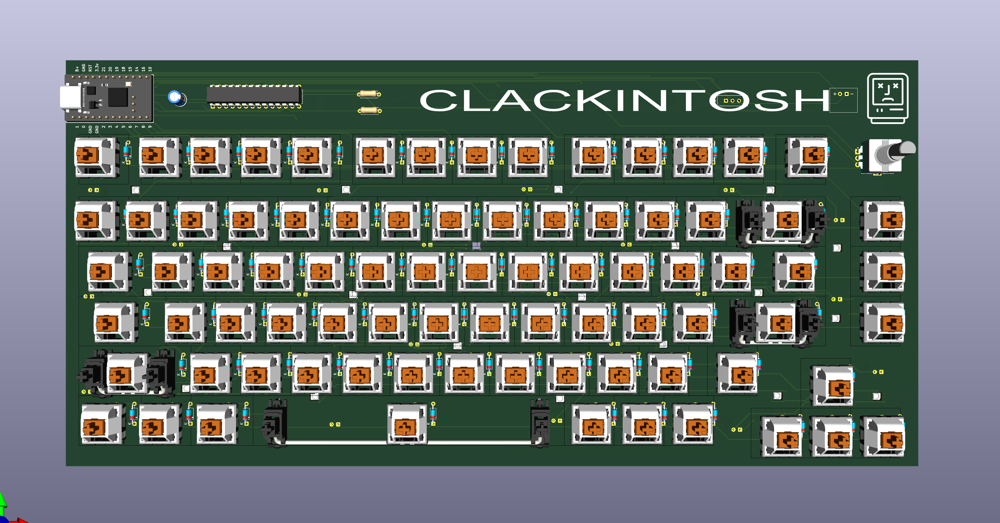
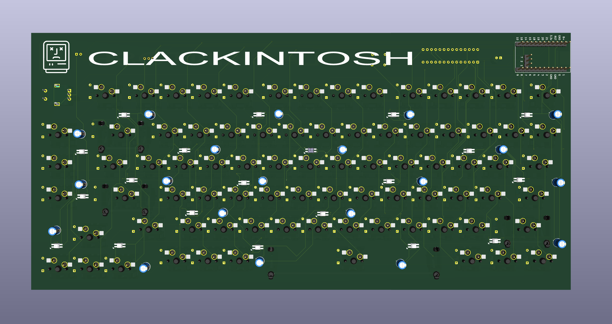

# Clackintosh
a wireless mechanical keyboard, with 75% layout (81 keys) and a rotary encoder. 
this accompanies my other hardware projects, namely, Clackinntosh Jr. (a macropad), Clackade (a small, very basic PCB-based game console), and Clickster (mouse based on Bambu Lab's Mouse Kit)

## Features
- 75% layout (81 keys) + a rotary encoder
- based on nice!nano v2 MCU
- has underglow LEDs to light up the side-printed keycaps
- hotswappable switches (Cherry MX Red/Brown)
- wireless with 10000mah battery
- ~ 4° tilt for ergonomics
- ZMK firmware
- a blank white case so that i can create a custom grafitti wall, but stickers and keeb case, on it

## Images

## General

### Schematic

### PCB

> this would have hotswappable switches, i did not add t to the pcb since i had to manually add for each key, the footprint is chosen appropriately)

### Case
> the case has space on top to add custom stickers (hackclub merch ones, since i don't know where to put them)

### Full Assembly
> the fully assembled one's PCB is not placed properly (not rotated to the correct angle) since there was some unknwon error in onshape where i could not rotate the thing, whenever i tried to rotate it would load and then no changes would occur. i tried my best to rotate it, and debug this but could not do so.
> will update the images if i'm able to do so in the future

## Challenges
the biggest challenge i faced was getting the schematcs right. i got the thing reviewed multiple times (on reddit, on #highway), added components, removed components, re-added components (capacitors, i'm looking at you)
another challenge was the case CAD, which had unexpected errors.

## BOM
|S. | Item | Quantity | Price | Link | Notes|
|---|------|----------|-------|------|------|
|1.| Case | 1 | - | - | printed though printing legion|
|2.| Switches - Akko V3 Cream Black Pro | 81 | Rs.2398 ($27.41) | [StacksKB](https://stackskb.com/store/akko-v3-cream-black-pro-switch-pack-of-45/) | ordered two since it is a packof 48, free shipping |
|3.| Hotswappable Sockets | 81 | Rs.1090 ($12.46) [incl. shipping of about $1.14] | [Neo Macro](https://neomacro.in/products/kailh-mx-hotswap-socket?variant=49467139227926) | 9 qty. ordered, since it is a set of 10 |
|4.| Stabilizers | 3 (2u) + 1 (6.5u) | Rs.1585 ($18.12) | [StacksKB](https://stackskb.com/store/durock-smokey-screw-in-stabilizers-v2/) | no shipping  charge |
|5.| Rotary Encoder - EC11 | 1 | Rs.172 ($1.97) | [Amazon.in](https://www.amazon.in/CentIoT-Encoder-Digital-Potentiometer-Control/dp/B0888RWNM1?crid=3H3ISLY2V9ZH5&dib=eyJ2IjoiMSJ9.ub-gVfIJkebgtPjQTQbP-1BNXrl39Ma9zP8YixnEs_uWGd82NzxokakbTgGlfXwvvbwKo1NhVn8iubL8tae9Wi_LafgLePaeA8Y5kPpV_qPI44pqsRB9mX7KN7ImQM3n8NkbTE3-eBYAXxmhAxua2NCHESNwFMZotrqkj7qS_SXR2kNxvQyZ_2nftByqA3GmRFQRc5_pbxpjeeLxiwJslTPwFi5ZTk4HPx0DrsHFBGxiNN7eGaSqn3sTKCzVceu6slag52Omg1vD_geqB3qQy1fCUWTE4n0WXS43WMdFLFM.jLY7U2FxXnWHCqS6s6jF70LCJ59HVkYHE3qNwtnKg8c&dib_tag=se&keywords=ec11+rotary+encoder&qid=1753984957&sprefix=ec1+rotary+encoder,aps,248&sr=8-3) | - |
|6.| Keycaps Set - side printed blue | 1 | Rs.1299 ($14.85) | [StacksKB](https://stackskb.com/store/veekos-gradient-keycaps-cherry-profile-135-keys/) | - |
|7.| Nice!Nano v2 --> Pro Micro | 1 | Rs.758 ($8.66) [incl. $1.13 shipping] | [Probots](https://probots.co.in/pro-micro-nrf52840-development-board-compatible-with-nice-nano-v2-0.html) | compatible with nice!nano, and wayy cheaper |
|8.| SK6812Mini-E neopixels | 20 | Rs.752.23 ($8.60) [incl. $3.74 shipping] | [LCSC](https://lcsc.com/product-detail/RGB-LEDs-Built-in-IC_OPSCO-Optoelectronics-SK6812MINI-E_C5149201.html) | for underglow for keycap visibility, not available anywhere else |
|9.| 100nF Capacitors | 21 | Rs.210 ($2.40) | [Amazon.in](https://www.amazon.in/100pcs-Ceramic-disc-Capacitor-100nf/dp/B08FB2NZ1L?crid=1P652WXADOQHF&dib=eyJ2IjoiMSJ9.E6nRIu5_9YSDNISKzn4qatrWKc7EAydC5mq-F6L7MHSy5aPsfXFMTJ5_YvUvcr9VMIJbHGUdi3eBkWF5oDmjaacjcfmvGjy_XeRrO_PjSvponr2Hf7R18_c3LzMLQi0FFVdox1j2iH-b0jLGImJp5rD-2L-z6mJmC7ETmGFaMeO5tWXr0HIAFSVg7xGD-4CcUEqQRS0xvEK06J5SDaOMluZfmk0X8pTOrxUoOlBwLcA.CWHiOOZnuk92qXruggDfBMzOhlwUS12HJFRN06HVaMo&dib_tag=se&keywords=100nf+50v+capacitor&qid=1753986573&sprefix=100nf+50v+capacitor,aps,259&sr=8-1) | decoupling + used in i2c expander |
|10.| I2C Expander - MCP23017 | 1 | Rs.258.99 ($2.96) | [RoboticsDNA](https://roboticsdna.in/product/mcp23017-e-sp-microchip-i-o-expander-16-bit-i2c-serial-1-8-v-5-5-v-dip-28-pins/) | short on GPIOs, had to use it |
|11.| Resitors - 4.7k ohm | 2 | Rs.9 ($0.10) | [Robocraze](https://robocraze.com/products/4-7k-resistor-pack-of-10?_psq=4.7k&_v=1.0) | pullups for i2c|
|11.| Diodes - 1N4148 though-hole | 81 | Rs.135 ($1.54) | [StacksKB](https://stackskb.com/store/1n4148-through-hole-diode/) | - |
|12.| 100000mah Battery | 1 | Rs.667 ($7.62) | [Amazon.in](https://www.amazon.in/Portronics-Luxcell-Charging-Output-Button/dp/B0CQK537RQ?crid=30FNXN02G1VQR&dib=eyJ2IjoiMSJ9.SeZBu50Z5maKPBAPuVGIZaCCnuOaK6YIpKFiUoF4lZQMYfVNpBJboLyC4tyXAsvwRIplSp-oxbmFdRZWTLahpCL1Q4RiwgB4HW9QNR0LmMgB_EUeq1E8ImJ_e7xXOxy0p5tsyDBqRuEUn6Z59A_S5TXZKBqEuU-zjyu8vzbfmJr2ysZdim2Oi61aNqKcXVYLygXPOqpGwnpAPvTcgXFo3tB0ZWwji8zyMWBCC2CIGC0.OQO0LtasTF-RZUJpMsytapOf96OHgtbrssq44zcfY8s&dib_tag=se&keywords=10000+mah+battery&qid=1753991573&sprefix=10000mag+battery,aps,203&sr=8-14&th=1) | for long battery life, using this since this is wayy cheaper then the li-po battery |
|13.| M3x12mm screws | 4 | Rs.159 ($1.82) | [Amazon.in](https://www.amazon.in/gp/product/B07XY78Q73?smid=A1QGCD9W0FP1ZA&th=1) | to assemble the case |
|13.| M3x5mm heatset inserts | 4 | Rs.170 ($1.94) | [Amazon.in](https://www.amazon.in/gp/product/B0CX1BS7DJ?smid=A1QGCD9W0FP1ZA&psc=1) | to assemble the case |
|14.| Slide Switch (SPDT) | 1 | Rs.14 ($0.16) | [Robocraze](https://robocraze.com/products/slide-switch-3-pin-2-way-spdt?_psq=spdt&_v=1.0) | to turn the keeb on/off |
|15.| PCB | 5 (default via jlcpcb) | Rs.2780.57 ($31.78) | - | - | 
|16.| Knob for rotary encoder | 1 | - | - | printed though printing legion |

**TOTAL AMOUNT = Rs.12,457.79 ($142.39) [excl. shipping for printing legion]**

## Credits

- made by: [unowen](https://github.com/pari55051)
- inspiration: some image i found on google
- schem: shout out to all the people who helped me fixed the thing
- case: shout out to "One For Freedom" for helping resolve errors in the cad

